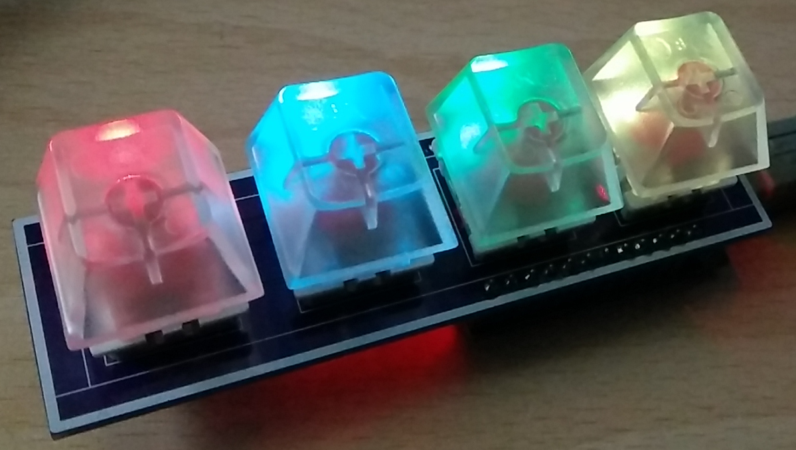

# PingBoard Daemon

[](https://github.com/RichardLitt/standard-readme)

> Daemon connecting the [PingBoard](https://github.com/PingTechGmbH/PingBoard) to [RabbitMQ](https://www.rabbitmq.com/)



A daemon that connects to a [PingBoard](https://github.com/PingTechGmbH/PingBoard) (or similar macro keyboard), then
sends key presses and accepts configuration via [RabbitMQ](https://www.rabbitmq.com/). The main goal is to enable the
PingBoard as an IoT input device and execute actions outside the USB host.

## Table of Contents

- [Usage](#usage)
- [API](#api)
- [Maintainers](#maintainers)
- [Contributing](#contributing)
- [License](#license)

## Usage

Run via docker:

```bash
docker run --rm -p 8080:8080 mrtux/pingboard-daemon
```

### Configuration

Configuration is done using environment variables:

* `MANAGEMENT_PORT`: Port for the HTTP Management Service (default: 8080)
* `AMQP_HOST`: RabbitMQ host
* `AMQP_USER`: RabbitMQ user
* `AMQP_PASS`: RabbitMQ password (default: empty)
* `AMQP_EXCHANGE`: RabbitMQ Exchange name (default: `pingboard`)
* `AMQP_RK_STATUS`: RabbitMQ routing key for status information (default: `status`)
* `AMQP_RK_KEY_1`: RabbitMQ routing key for key 1 press (default: `1.key`)
* `AMQP_RK_KEY_2`: RabbitMQ routing key for key 2 press (default: `2.key`)
* `AMQP_RK_KEY_3`: RabbitMQ routing key for key 3 press (default: `3.key`)
* `AMQP_RK_KEY_4`: RabbitMQ routing key for key 4 press (default: `4.key`)
* `AMQP_RK_CONFIG`: RabbitMQ routing key to retain configuration (default: `pingboard-configuration`)
* `AMQP_QU_CONFIG`: RabbitMQ queue for configuration updates (default: `pingboard-configuration`)

## API

### RabbitMQ routing

The daemon expects a specific setup for RabbitMQ:

* All messages are sent to one single exchange.
* There are specific routing keys for status updates and key 1 to 4 presses.
* Configuration is received on a separate queue. Exchange and routing keys can be configured with the environment
  variables.

In the current version the exchange, queues and bindings are not set up automatically, so RabbitMQ has to be prepared
accordingly.

To route multiple or all keys to the same queue, either create the respective bindings or set all routing keys to the
same value.

### Messages

All messages are encoded in the JSON format.

#### Key presses

The message for a key press is structured as follows:

```json
{
  "key": 1
}
```

The value can be a number between 1 and 4, depending on the key pressed.

#### Pingboard Configuration

Pingboard configuration, i.e. brightness, key colors and blinking, can be set with the following JSON:

```json
{
  "configuration": {
    "brightness": 255,
    "keys": [
      {
        "idx": 1,
        "color": [
          255,
          255,
          255
        ]
      },
      {
        "idx": 2,
        "color": [
          0,
          0,
          0
        ]
      },
      {
        "idx": 3,
        "color": [
          0,
          0,
          0
        ]
      },
      {
        "idx": 4,
        "color": [
          0,
          0,
          0
        ]
      }
    ],
    "blink": [
      {
        "idx": 1,
        "mode": "OFF",
        "color": [
          255,
          0,
          0
        ]
      },
      {
        "idx": 2,
        "mode": "SINGLE",
        "color": [
          255,
          0,
          0
        ]
      },
      {
        "idx": 3,
        "mode": "SHORT",
        "color": [
          255,
          0,
          0
        ]
      },
      {
        "idx": 4,
        "mode": "LONG",
        "color": [
          255,
          0,
          0
        ]
      }
    ]
  }
}
```

Fragmentation is accepted, following these rules:

* An arbitrary permutation of the top-level elements can be sent.
* `"keys"` and `"blink"` accept an arbitrary number of array elements. Arrays are processed in the order of elements,
  i.e. if a key is set twice in an array, the last setting will be stored.

If the Pingboard is available, all settings will be written in their order of appearance.

Please note that the key index is one-based.

#### Error message

An error is structured like this:

```json
{
  "error": {
    "message": "Short error message",
    "details": "Detailed explanation of the error",
    "original": "Original message that lead to the error, if applicable"
  }
}
```

## Maintainers

* [@penguineer](https://github.com/penguineer)

## Contributing

PRs are welcome!

If possible, please stick to the following guidelines:

* Keep PRs reasonably small and their scope limited to a feature or module within the code.
* If a large change is planned, it is best to open a feature request issue first, then link subsequent PRs to this
  issue, so that the PRs move the code towards the intended feature.

Small note: If editing the README, please conform to
the [standard-readme](https://github.com/RichardLitt/standard-readme) specification.

## License

MIT © 2022 Stefan Haun and contributors
